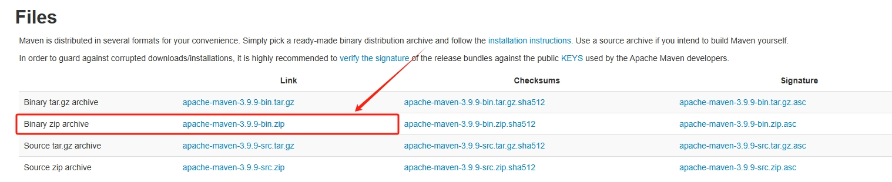
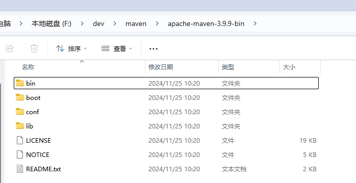
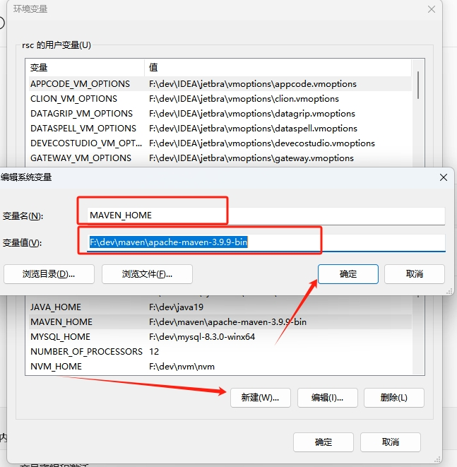
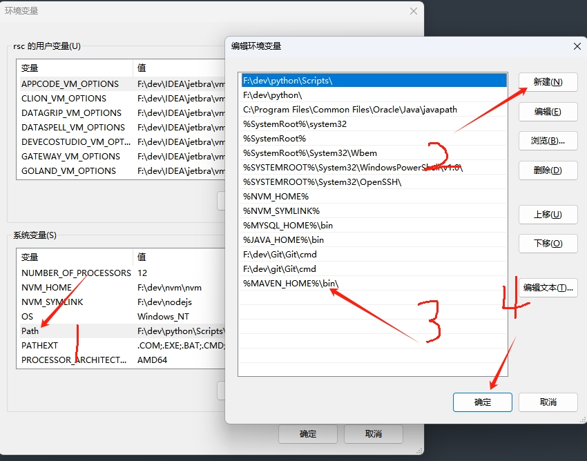
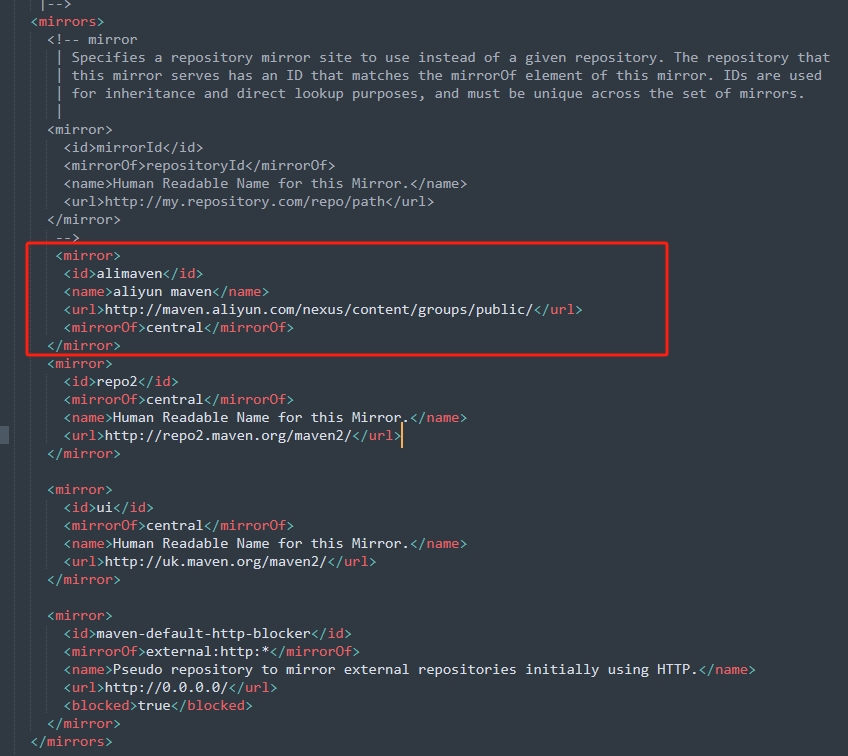
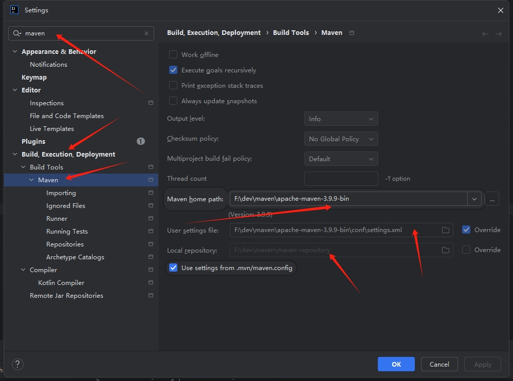

maven 
====================

toctree::
    .. :maxdepth: 2
    .. :numbered: 2

安装 
----------

1. 下载并安装 `maven <https://maven.apache.org/download.cgi/>`_

2. 将文件解压到 ``F:\dev\maven\apache-maven-3.9.9-bin`` 目录下

3. 新建环境变量MAVEN_HOME，赋值 ``F:\dev\maven\apache-maven-3.9.9-bin``

4. 编辑环境变量Path，追加%MAVEN_HOME%\bin\;

5. 至此，maven已经完成了安装，我们可以通过DOS命令检查一下我们是否安装成功::

    mvn -v

 
配置Maven本地仓库
-----------------

1. 配置maven缓存到本地的仓库地址

打开 ``F:\dev\maven\apache-maven-3.9.9-bin\config\settings.xml`` ::

   // localRepository节点用于配置本地仓库，本地仓库其实起到了一个缓存的作用，它的默认地址是 C:\Users\用户名.m2。

   <localRepository>/path/to/local/repo</localRepository>

2. 配置maven线上仓库下载地址::
    
    <mirror>
      <id>alimaven</id>
      <name>aliyun maven</name>
      <url>http://maven.aliyun.com/nexus/content/groups/public/</url>
      <mirrorOf>central</mirrorOf>
    </mirror>    

idea配置maven
-----------------

File->Settings 配置如下

