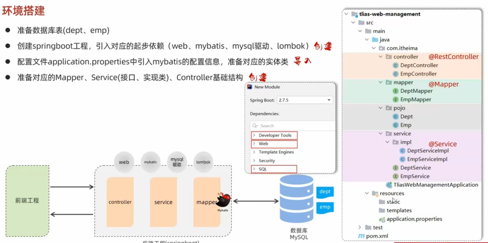
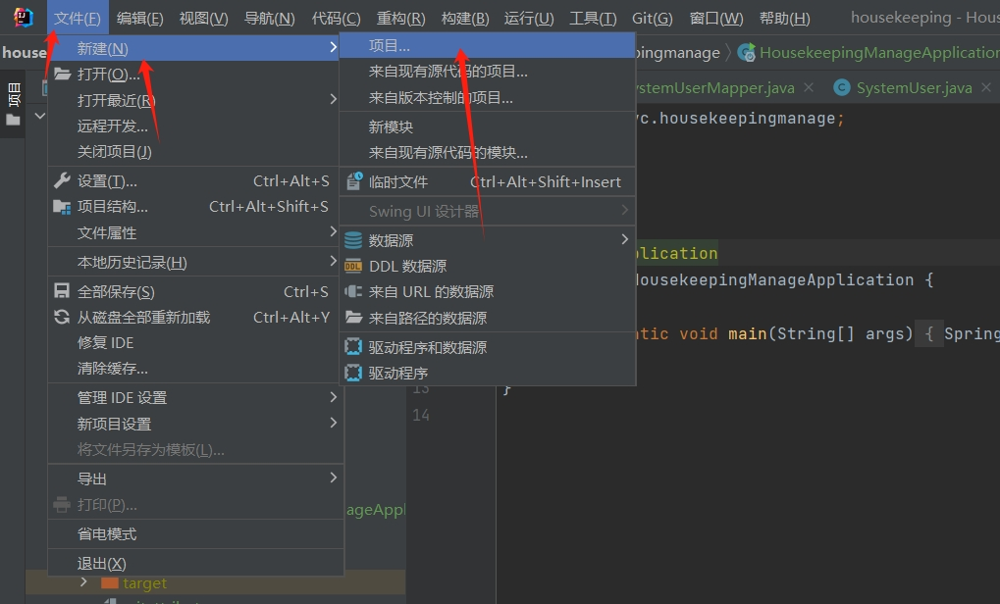
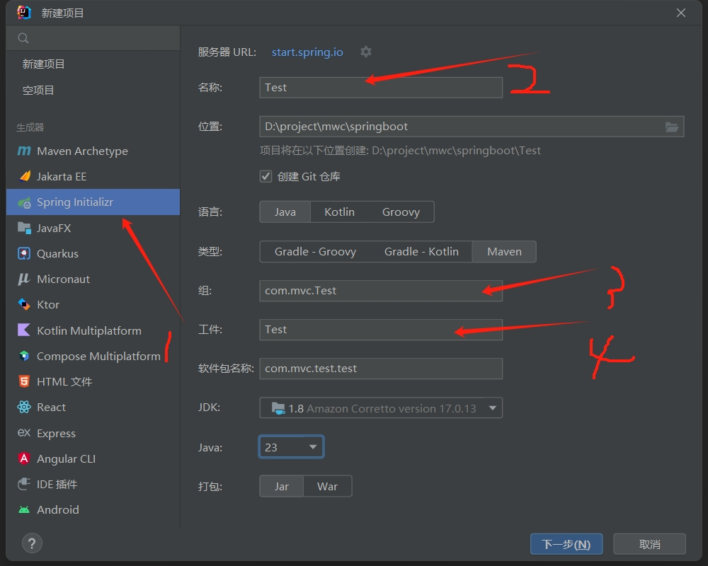
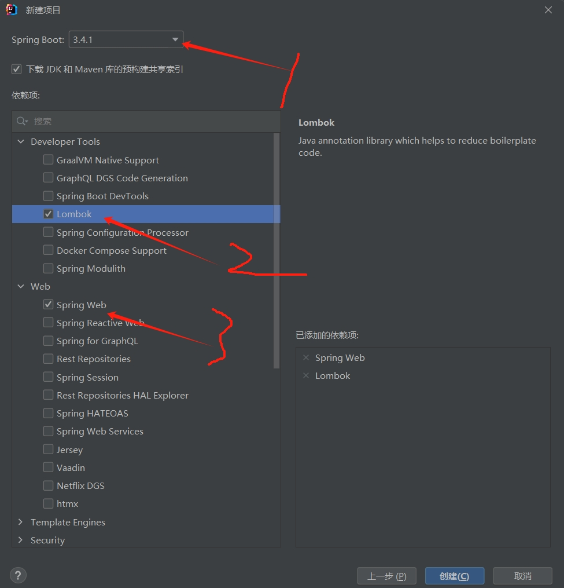

 # 环境搭建 #
 环境搭建需要以下四个步骤
 

 ## 准备数据库 ##
 [该步骤见mysql数据库章节教程](../mysql/01_doc.md)

 ## 创建springboot工程 ##  
 1.新建 
 

 2.填写项目信息及勾选项目目录
 

 3.创建项目需要勾选web开发常用的启动类 
  

 4.编写代码启动
  

  ## 配置文件配置mybatis ## 

  详情见[配置mybatis](./02_mybatis.md)