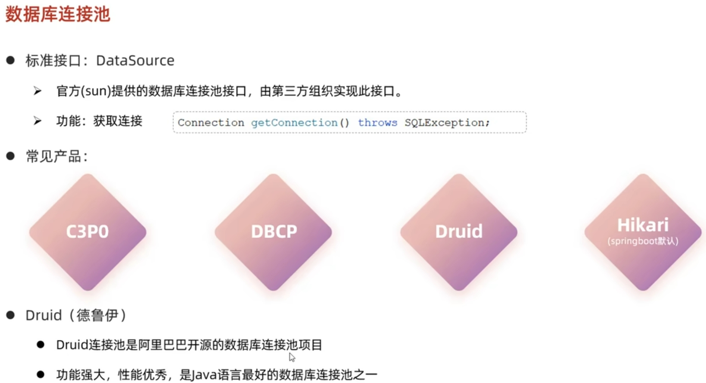
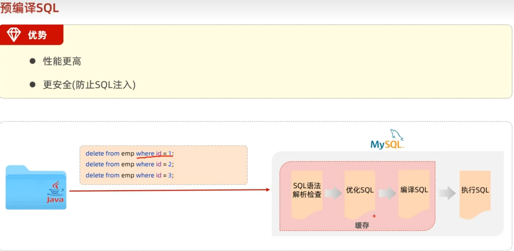
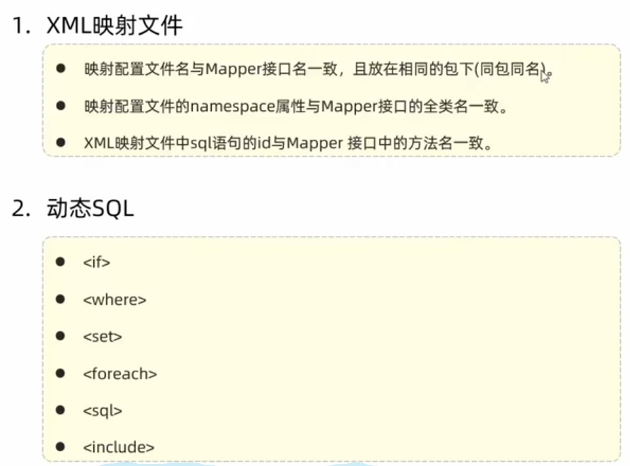
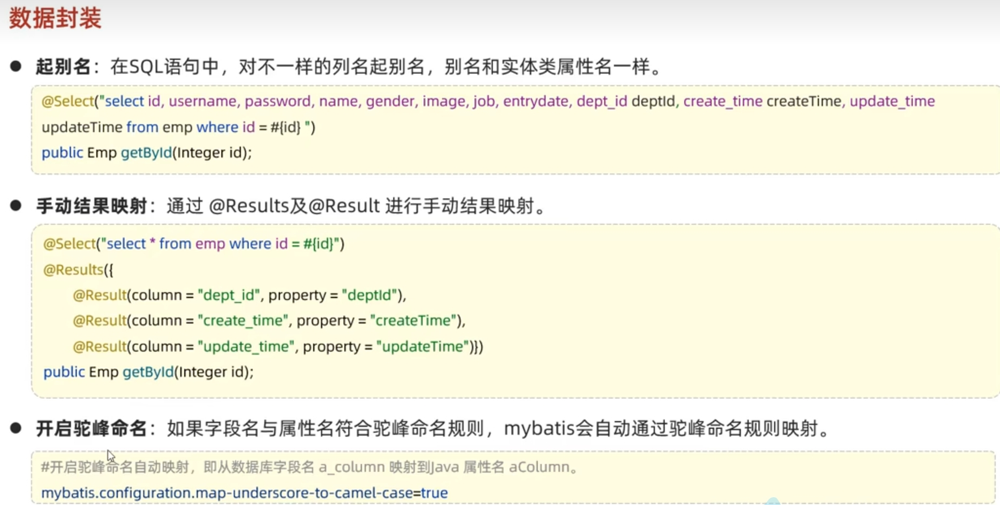
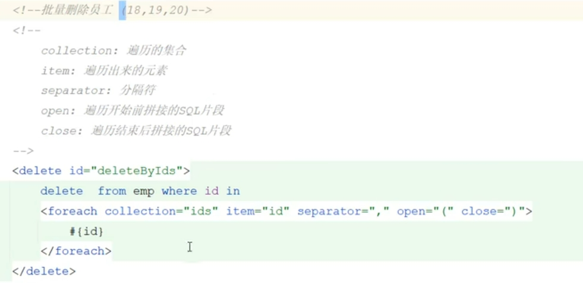

 # mybatis #

 ### 什么是mybatis
 
 <a href="https://mybatis.org/mybatis-3/zh/index.html" target="_blank">中文官方文档</a> 
https://mybatis.p2hp.com/index.html
 

 
### 快速入门

 
  
 
 
 

### idea配置sql提示

 
  
 
### JDBC
   #### 简介 #### 
 __DBC是sun公司提供的一套操作关系型数据库的API(规范)__
  

#### 使用示例 ####
  
  
  

#### jdbc和mybatis对比 ####
  

### 连接池 ###
#### 连接池(德鲁伊)使用 ####
__德鲁伊<a href="https://github.com/alibaba/druid/tree/master/druid-spring-boot-starter" target="_blank">官方地址</a>__

加载启动类在pom.xml
```
 <dependency>
            <groupId>com.alibaba</groupId>
            <artifactId>druid-spring-boot-starter</artifactId>
            <version>1.2.16</version>
        </dependency>
```

 
 

#### 其他链接池及介绍 #### 

 
 
 

### sql日志输出控制台 ### 

 

### 预编译sql ### 
 
 
 
 

### 使用mybatis准备工作 ### 
 
 


### 增加操作 ### 

#### 普通新增操作 ### 
 

#### 新增同时主键返回 ### 
 
  

### 删除操作 ### 

  

### 更新操作 ### 

  
  

### 查询操作 ###  
  
#### 数据库返回和对象字段不匹配 ####  
  
#### 没匹配不上的原因 ####  
  
#### 驼峰和下划线转化解决 ####  
  

#### 解决示例代码 ####  
  
#### 带有条件查询 ####  
  

#### 占位问题 ####  
如果根据名字会进行模糊查询，但是模糊查询不支持参数如name字段
 

#### concat解决占位问题 ####  
 

#### springboot版本1和2的对比 ####  
 
 

#### xml写sql的准备条件 ####  
-  ***XML映射文件的名称与Mapper接口名称一致，并且将XML映射文件和Mapper接口放置在相同包下(同包同名)***
-  ***XML映射文件的namespace属性为Mapper接口全限定名一致。***
-  ***XML映射文件中sql语句的id与Mapper接口中的方法名一致，并保持返回类型一致。***
 

#### xml写动态sql #### 
写动态sql的主要原因是，过滤条件的个数不确定,导致sql拼接错误，比如where，set，或者and关键字，是必须有条件的时候才有用。
##### if判断 ##### 
 if去判断是否有过滤条件 

 
##### where标签 ##### 
 where标签自动判断是否需要加and如果有条件就加没条件就不加

 
##### set标签 ##### 
set用法和where一样都是mybatis自动判断过滤条件是否存在，来改变sql语句

 

##### forEach标签 ##### 
当同时执行一个数组的条件时，比如同时删除多个，会有多个id数组传递过来。这时采用forEach遍历到sql的in中

 
 

##### sql和include配对标签 ##### 
当多个sql语句产生一样的片段时，可以把相同的sql片段单独提取出来，通过include方式导入

  

#### 动态sql总结 #### 

  

#### mybatis插件 #### 


    