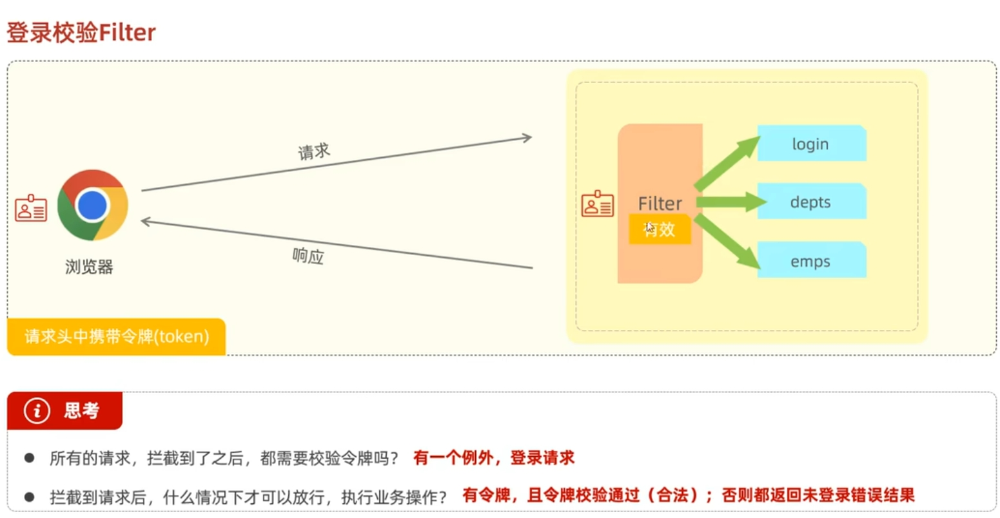

 # servelt过滤器 #
 

  ### filter介绍 
 
 
 ### filter快速入门
 

 ### filter快速入门小结
 

 ### filter执行流程
 

 ### filter问题
 

 ### filter拦截规则
 

 ### filter拦截流程
 

 ### 多个filter组成的链
 

 ### filter总结
 

 ### 登录拦截器实例
 

 ### 登录拦截器步骤
 