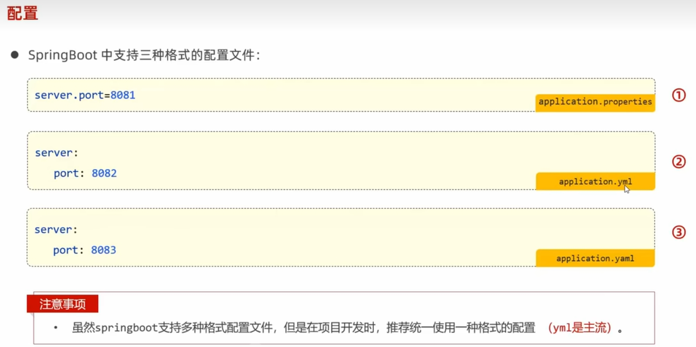
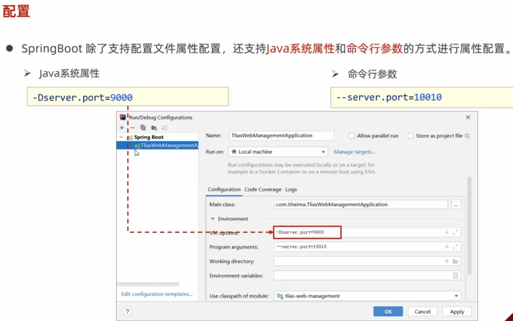
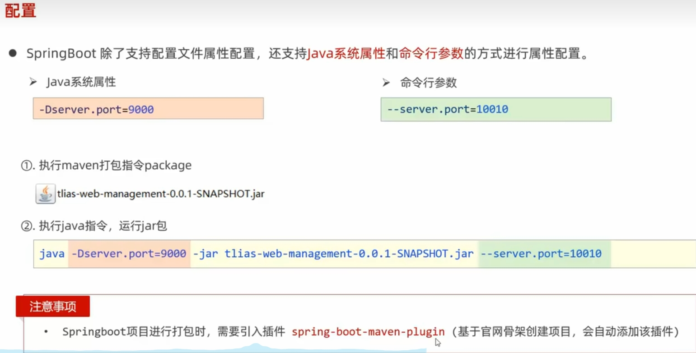
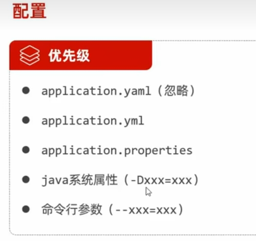

 # 端口配置 #
 
 ## 配置文件配置端口 ##
在springboot项目的 `\src\main\resources`目录下新建`application.properties`或者`application.yml`，`application.yaml`三个配置文件

;

## 设置Java属性参数或命令参数方式 ##
### 通过idea配置 ###
如下图所示：
;

### 通过命令窗方式 ###

如下图所示：

;

## 设置端口的引用优先级 ##

如下图所示：

;